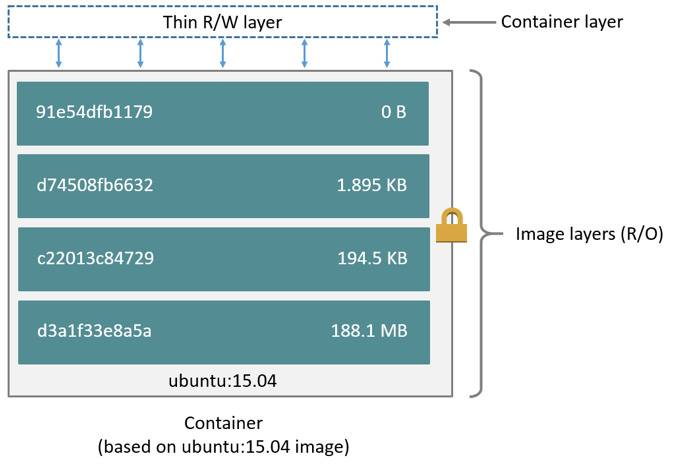

# 30 Days of Docker - Day 17

    اليوم غادي نهضروا على أكثر على Docker Images و على كيفاش نكتبوا Dockerfiles أحسن ..  
    باش يstore'e الimages ديالنا Docker تايعتامد على Storage Drivers لي تايخزنوهم على شكل Layers في Filesystem ديالنا ..
    فاش كانكونوا خدامين على Dockerfile منين تانديرو شي command بحال COPY أو ADD أو RUN تاتصايب Layer جديدة .. مثلا في هاذ المثال غادي يتصايبوا 3 ديال layers

    # This will create 3 layers
    RUN apt update
    RUN apt install ca-certificate
    RUN apt install curl

    و هاذشي لي ممكن يزيد الحجم ديال image ديالنا بزاف .. باش نعرفوا علاش خاصنا نفموا خاصية جديدة لي تايستعملها Storage Driver لي هي Copy On Write (COW) ..
    جميع الlayers في image ديالنا تايكونوا ثابتين Immutable و مايمكناش نبدلوا فيهم مباشرة Read Only ...
    باش نبدلو شي file كاين في شي layer في شي layer تحت منها .. Docker تايدير واحد النسخة لهذاك الfile في الlayer الجديدة و تايبدل فيها (مادام مايمكنش يبدل في Layer الفوقانية حيت هي Immutable) .. مثلا هنا في هاذ المثال، غادي يكوونوا عندنا 2 ديال النسخ ديال DevC.txt كل واحدة في Layer بوحدها ..

    # Create DevC.txt file in laye1
    RUN echo "DevC" > /DevC.txt
    # Copy DevC.txt from layer1 and add content to it
    RUN echo " Rabat" >> /DevC.txt

    أكثر من هاذشي، حتا المسيح Deletetions ماتايبدلوش في Layers لي قبل بل غير تايحجبوا هاذوك files لي مسحنا من Layer الحالية
    يعني ايلا رجعنا للمثال الأول جميع الfiles لي غادي تبدلهم apt غادي تدير منهم نسخ جديدة و هاذشي غادي يكبر حجم Image ديالنا بزاف.
    أخيرا الحل ديال هاذشي هي نديروا أقل عدد ممكن ديال Layers قدر المستطاع يعني المثال ديالنا ممكن نحولوه لشي حاجة بحال هاكا، لي غادي يصايب لينا غير layer واحدة

    # This will create 3 layers
    RUN apt update && apt install -y ca-certificate curl

    علاش هاذشي كاع؟
    هاذ البلان ديال layers تايبان ماصالحش، ولك في الواقع هو مهم بزاف حيت تايعطينا الامكانية، نشاركوا layers بين بزاف ديال images و containers و تايعطينا القدرة على أننا نCache'ew هاذ الLayers بين Builds و نسرعوا Build .

    ملاحظات:
    <ul>
    <li>كاينين Commands لي ماتايصايبوش layers جداد بحال Expose مثلا </li>
    <li>الStorage Drivers هوما واجهة لل Filesystems لي تايوفروا هاذوك الخاصيات بحال COW و Layering .. الFS الأكثر استعمالا هو OverlayFS 2 </li>
    </ul>

