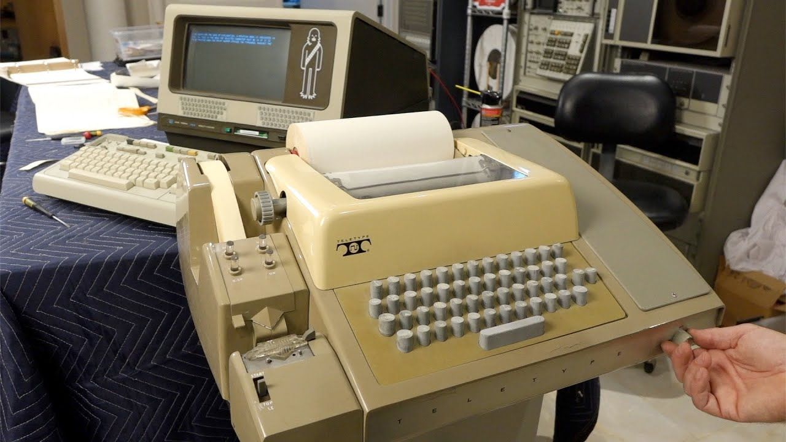

# 30 Days of Docker - Day 22

هاذ البوسط غادي نهضروا على واحد من أهم المواضيع لي كنت بغيت نهضر عليهم، مادام فيهم بزاف ديال الغموض و لليهوما ttys و standard I/O streams
هاذ المفهومين غادي ينفعونا نفهموا شي جزئيات في Docker run و Docker create و عموما مهمين بزاف و غادي نلقاوهم في كل بلاصة في عالم Containers و Linux .

### الTTY

من أهم المبادئ لي في لينكس هي Everything is a file يعني جميع الحوايج لي كاينين في السيتام ديالنا تايتعامل معها الkernel على أساس أنها files
من أهم الأمثلة الDevices .. جميع الDevices لي عندنا مجموعين في files في واحد الضوسيي سميتو dev/ و أغلبيتهم ممكن نقراو منهم و نكتبوا فيهم (حيت هوما مجرد files).. مثلا ممكن تحل الكاميرا ديال البيسي ديالك و تشوف راسك باستعمال media player ديال مثلا vlc أو mpv

    mpv /dev/video0

هاذ الDevices منهم لي تايكونوا حقيقين و مبرونشين في الحاسوب ديالنا بحال disk في `dev/sdX/` (السمية تاتختالف على حساب الديسترو، و على حساب الconnectors ... و الكاميرا `dev/video0/` (تاهي تاتختالف على حساب السيستام ديالك)

و منهم لي تايكون مصايبهم kernel باش يديرو شي خدمة بحال `dev/null/` و `dev/random/`

من أهم الdevices لي تانلقاو هوما `dev/ttyx/` (مع x عدد صحيح طبيعي) .. لي تايشيرو لTeleType ..
هاذ الTeleTypes هوما واحد الآلات كانوا تايتسخدموا شحال هاذي باش يدخلو input و يخرجوا output من الحواسيب (بحال لي في التصورية)
    
مع الوقت TeleTypes مابقاوش ولكن بقات هاذوك Drivers لي مكلفين بيهم في Unix و من بعدو Linux و ولا عندهم استعمال آخر (نفس الاستعمال غير الDevices لي تبدلو)

اليوم tty هوما واحد Devices لي تايصايبهم Kernel و لي تاياخدوا input ديالنا من Keyboard و تايوريونا output في Screen .. هوما لي تانسميوهم اليوم الTerminal 😁😁
الLinux Kernel تايصايب بزاف ديل tty (على حساب السيستام ديالك) و ممكن نتنقلوا بينات شي وحدين منهم باستعمال CTRL+ALT+F1-9

كاين مشكل ..
كيفما قلنا kernel تايصايب لينا واحد العدد محدود من terminals و لكن في الوقت ديالنا مع Desktop environment ممكن نحلو مئات الterminals مغلا في tmux و ماكاينش مشكل .. ماشي غادي يساليو لينا ttys ؟
الحل هنا هو الuserpace ttys أو pseudo tty أو ptty .. هاذ النوع الجديد ديال الttys ماتايكونش مبرونشي نيشان مع kernel و تايعطينا الامكاينية نصايبو بزاف ديال ttys .. مادام تايخدم ب Master Slave Architecture لي تاتكون فيها مكون master واحد ptmx و بزاف ديال المكونات slave لي هو pts و لي هوما لي تايهمونا
التطبيقي
باش نعرفوا اينا tty حنا فيه يكفي نستعملو الكوموند

    tty
    # output /dev/pts/14

و باش نبدلو الإعدادات ديال شي tty تانستعملوا stty مثلا ايلا درتي full screen و داكشي بقى مقطع ممكن تستعمل stty باش تبدل الطول و العرض ديال tty

    stty -F /dev/pts/10 rows 29 columns 10
    stty -a # to display all settings

إيلا بغيتي تعرف أكثر على ttys ممكن تشوف هنا

http://www.linusakesson.net/programming/tty/index.php

### ال standard I/O streams
    
الموضوع الثاني هو stdio streams .. في لينكس كل process تاتكون عندوا واحد file descriptor table لي تايكون فيها جميع files لي حالهم و كيفاش تايتعملهم مرتبين من 0 لواحد الرقم محدد غالبا تايكون 1024 و ممكن نبدلوه.
من هاذ الfile descriptors تايكون عندنا واحد 3 مميزين ليهموما من 0 ل 2 أو بالترتيب STDIN و STDOUT و STDERR ..
    
هاذو بكل بساطة تايتكلفوا ب standard I/O يعني أي حاجة تاتدخل و تاتخرج بالشكل default/standard يعني باستعمال print و scanf (تقريبا، حيت حتى هاذو ممكن نقولو ليهم يكتبوا في بلايص آخرين ماشي standard)
    
المهم باش نشوفوا هاذ الfd ممكن نمشيو ل proc/ .. ايلا كان pid ديال الprocess ديالنا هو 1200 نلقاوهم في

    ls /proc/1200/fd

للاشارة هاذو تاهوما files وممكن نقراو منهم و نكتبو فيهم ب unix utils مثلا هاذي

    echo "Hello DevC Rabat" > /dev/1200/fd/0

مكافئة لأننا ندخلو input لبورغرام ديالنا نيشان من terminal (جربوها مع شي scanf في شي بروغرام.)

### ال standard I/O streams و علاقتهم بTTYs 

أغلب الprocesses ليتاrun'ew في terminals تايكونوا std I/O streams ديالهم كاملين مبرونشيين مع tty device لي هوما خدامين فيه ..
مثلا ايلا شدينا واحد البروغرام DevC.bin و خدمناه في `dev/pts16/` عموما (ايلا مابدلناش في اللوجيك لداخل أو ايلا مادرناش redirections أو pipes في command line) غادي يكونوا الfds من 0 ل2 مجرد symlinks ل `dev/pts16/`

    ./DevC.bin # run in the foreground
    # from another tty
    ls -l /proc/1234/fd
    total 0
    lrwx------ 1 devc devc 64 Sep 12 02:38 0 -> /dev/pts/16
    lrwx------ 1 devc devc 64 Sep 12 02:38 1 -> /dev/pts/16
    lrwx------ 1 devc devc 64 Sep 12 02:38 2 -> /dev/pts/16

باش نعرفوا واش شي fd مبرونشي مع شي tty ممكن نقلبو في proc/ مباشرة ولا ممكن نستعملوا واحد الfunction سميتها `(fd)isatty` من وسط الprogram ديالنا ..

ملاحظات

<ul>
    <li> أغلب اللعيبات لي في docker مبنيين على Linux technologies ذاكشي علاش غادي يخاصنا نفهمو شوية Linux ايلا بغينا نفهموا Docker و Containers عموما </li>
</ul>

